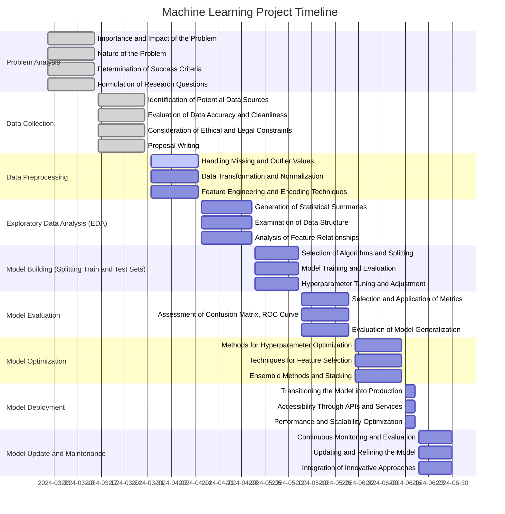

# Gantt Chart for Project Timeline

```mermaid
gantt
    title Machine Learning Project Timeline

    dateFormat  YYYY-MM-DD
    section Problem Analysis
    Importance and Impact of the Problem        :done,    p1, 2024-03-01, 2024-03-15
    Nature of the Problem                       :done,    p2, 2024-03-01, 2024-03-15
    Determination of Success Criteria           :done,    p3, 2024-03-01, 2024-03-15
    Formulation of Research Questions           :done,    p4, 2024-03-01, 2024-03-15

    section Data Collection
    Identification of Potential Data Sources    :done,    d1, 2024-03-16, 2024-03-30
    Evaluation of Data Accuracy and Cleanliness :done,    d2, 2024-03-16, 2024-03-30
    Consideration of Ethical and Legal Constraints :done, d3, 2024-03-16, 2024-03-30
    Proposal Writing                            :done,    d4, 2024-03-16, 2024-03-30

    section Data Preprocessing
    Handling Missing and Outlier Values         :active,  dp1, 2024-04-01, 2024-04-15
    Data Transformation and Normalization       :         dp2, 2024-04-01, 2024-04-15
    Feature Engineering and Encoding Techniques :         dp3, 2024-04-01, 2024-04-15

    section Exploratory Data Analysis (EDA)
    Generation of Statistical Summaries         :         eda1, 2024-04-16, 2024-05-01
    Examination of Data Structure               :         eda2, 2024-04-16, 2024-05-01
    Analysis of Feature Relationships           :         eda3, 2024-04-16, 2024-05-01

    section Model Building (Splitting Train and Test Sets)
    Selection of Algorithms and Splitting      :         mb1, 2024-05-02, 2024-05-15
    Model Training and Evaluation              :         mb2, 2024-05-02, 2024-05-15
    Hyperparameter Tuning and Adjustment       :         mb3, 2024-05-02, 2024-05-15

    section Model Evaluation
    Selection and Application of Metrics       :         me1, 2024-05-16, 2024-05-30
    Assessment of Confusion Matrix, ROC Curve  :         me2, 2024-05-16, 2024-05-30
    Evaluation of Model Generalization         :         me3, 2024-05-16, 2024-05-30

    section Model Optimization
    Methods for Hyperparameter Optimization    :         mo1, 2024-06-01, 2024-06-15
    Techniques for Feature Selection           :         mo2, 2024-06-01, 2024-06-15
    Ensemble Methods and Stacking              :         mo3, 2024-06-01, 2024-06-15

    section Model Deployment
    Transitioning the Model into Production   :         md1, 2024-06-16, 2024-06-19
    Accessibility Through APIs and Services   :         md2, 2024-06-16, 2024-06-19
    Performance and Scalability Optimization :         md3, 2024-06-16, 2024-06-19

    section Model Update and Maintenance
    Continuous Monitoring and Evaluation     :         mu1, 2024-06-20, 2024-06-30
    Updating and Refining the Model          :         mu2, 2024-06-20, 2024-06-30
    Integration of Innovative Approaches     :         mu3, 2024-06-20, 2024-06-30

```
